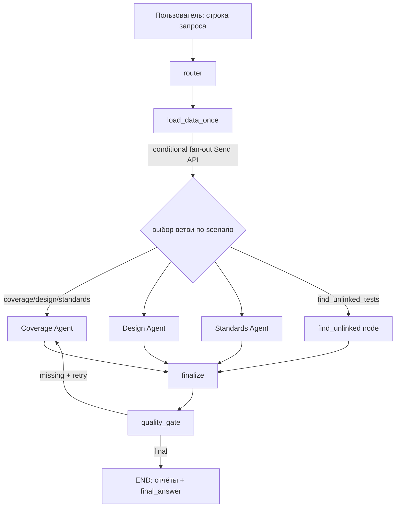
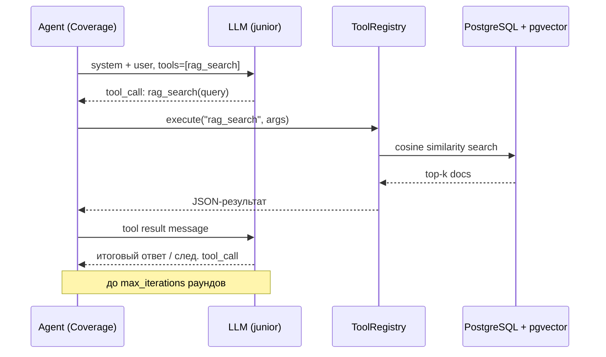
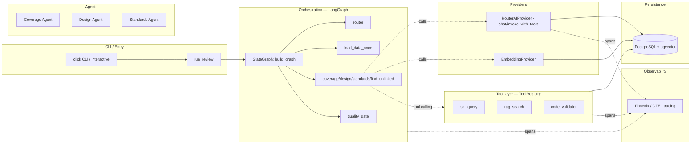
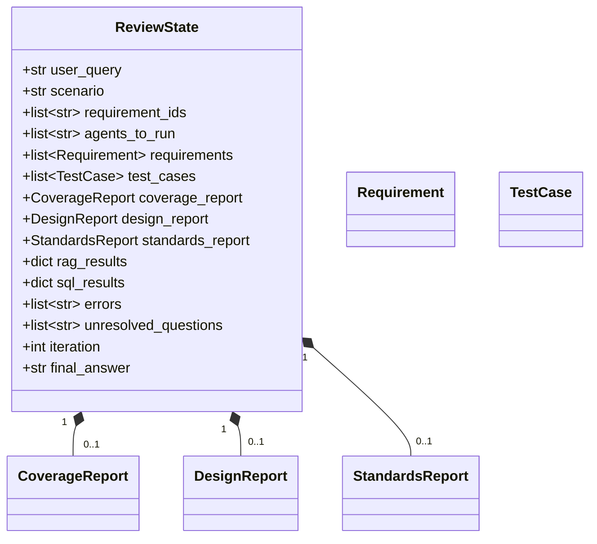
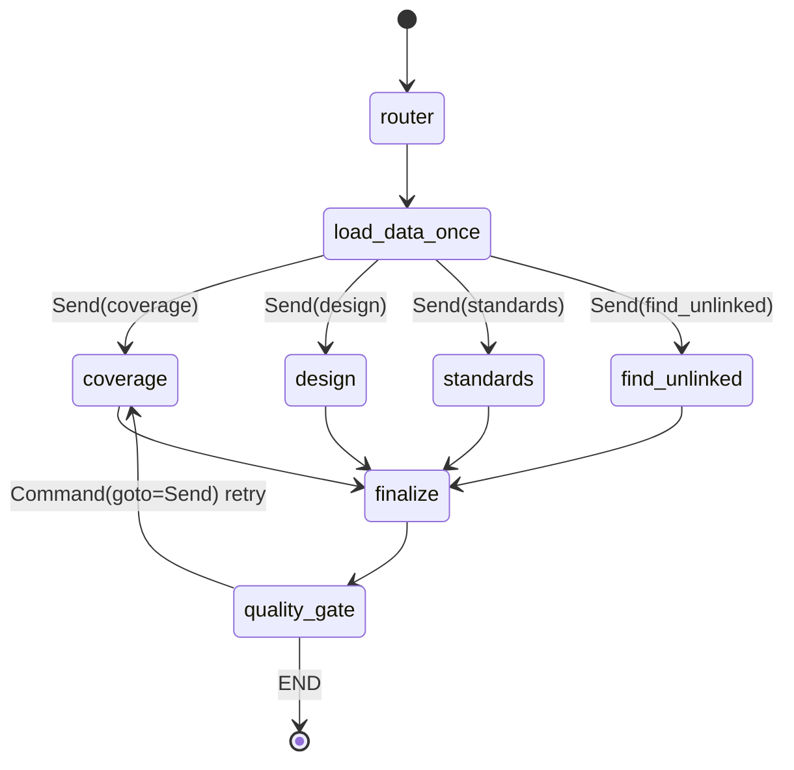

# QA Review Agent — Архитектурное описание (Требование 1/5)

**Цель документа:** описать прикладной кейс, сценарий работы агента (вход → обработка → результат), цикл Reason → Act → Observe, логику выбора моделей и зафиксировать архитектуру решения со схемой.

---

## 1. Прикладной кейс

Приложение **QA Review Agent** — это мультиагентная система автоматического ревью тестовой документации интернет-магазина (`data/online_store_test_cases.csv`, `data/requirements.csv`). Система анализирует набор требований (requirements) и тест-кейсов (test_cases) и выдаёт структурированные отчёты по трём независимым осям качества:

1. **Покрытие** (Coverage) — покрыты ли требования тестами, есть ли тесты без требований, косвенное покрытие.
2. **Дизайн** (Design) — применены ли техники тест-дизайна, дубликаты, слабые тесты.
3. **Стандарты** (Standards) — соответствие тест-кейсов реестру правил `data/standards_rules.yaml` (QA-TEST-001..010).

Дополнительный сценарий — поиск тестов без привязки к требованиям (`find_unlinked_tests`) чистым SQL.

Кейс соответствует реальной инженерной задаче QA-инженера: перед релизом проверить, что тестовая база не содержит пропусков, дублей и нарушений оформления, и оценить остаточный риск.

---

## 2. Сценарий работы агента

Поток «вход → обработка → результат» реализован как граф LangGraph (`src/graph.py::build_graph`).

**Вход.** Строка естественного языка, например:
- `провести полное ревью`
- `проверить покрытие REQ-001`
- `оценить дизайн тестов`
- `проверить стандарты`
- `найти тесты без требований`

Передаётся в `run_review(user_query)` (`src/report.py:278`), оборачивается в `ReviewState(user_query=...)` и запускает скомпилированный граф.

**Обработка.**
1. `router` (`src/graph.py:79`) классифицирует запрос → `scenario` + `requirement_ids` + `agents_to_run`.
2. `load_data_once` (`src/graph.py:224`) селективно выгружает данные из PostgreSQL (полная выгрузка / только запрошенные REQ / пропуск для `find_unlinked_tests`).
3. Параллельный fan-out агентов через LangGraph `Send` (`src/graph.py:146`).
4. Каждый агент формирует Pydantic-отчёт (`CoverageReport` / `DesignReport` / `StandardsReport`).
5. `quality_gate` (`src/graph.py:313`) проверяет комплектность и при частичном сбое повторяет только упавших агентов.

**Результат.**
- Markdown-отчёты в `reports/` (`save_reports`, `src/report.py:231`): `report_coverage_*.md`, `report_design_*.md`, `report_standards_*.md`, `report_summary_*.md`.
- `state.final_answer` — краткая сводка (проценты/счётчики).
- Спаны трассировки в Phoenix (OTEL).
- При сбое роутинга — просьба переформулировать (`ROUTING_FAILED_MESSAGE`, `src/graph.py:30`).

---

## 3. Цикл Reason → Act → Observe

Архитектура реализует классический агентный цикл на двух уровнях.

### 3.1 Оркестрационный уровень (маршрутизатор)
- **Reason:** `router` анализирует запрос (LLM-классификатор `model_junior` или regex-фоллбэк) и выводит план `scenario`/`agents_to_run`.
- **Act:** граф строит fan-out и запускает узлы агентов.
- **Observe:** `quality_gate` считывает заполненность `coverage_report`/`design_report`/`standards_report` и принимает решение о retry или финализации.

### 3.2 Уровень инструментов (Tool-calling loop)
Внутри агентов реализован цикл Reason → Act → Observe через `RouterAIProvider.invoke_with_tools` (`src/llm_provider.py:170`):

Агент **рассуждает**, какой инструмент нужен, **действует** (вызывает его через реестр), **наблюдает** результат и либо делает ещё один вызов, либо формирует финальный ответ.

---

## 4. Логика выбора моделей (минимум 2 типа задач)

Выбор модели централизован в `src/config.py` через `Settings` и применяется в точках вызовов:

| Задача | Модель (настройка) | Назначение | Где |
|---|---|---|---|
| Классификация запроса (роутер) | `model_junior` (`deepseek/deepseek-v4-flash-0731`) | быстрый, дешёвый routing, JSON | `src/graph.py:_llm_route` |
| Семантический RAG-поиск (выбор похожих ТК) | `model_junior` | эмбеддинг-запрос через function-calling | `src/agents/coverage_agent.py:196` |
| Глубокий анализ (coverage/design/standards) | `model_senior` (`deepseek/deepseek-v4-pro-0813`) | точная классификация, JSON schema | `src/agents/*` вызовы `chat_completion` |
| Векторизация текста | `model_embedding` (`openai/text-embedding-3-small`, 1536-dim) | RAG-эмбеддинги | `src/embedding.py` |
| Тарификация (метрика $) | — | `model_pricing` по моделям | `src/report.py:378` |

Логика «задача → модель»:
- **Лёгкие задачи классификации/поиска** → `model_junior` (низкая латентность, дешевле).
- **Аналитические задачи** (оценка покрытия/дизайна/стандартов) → `model_senior` (точность, structured output).
- **Векторизация** вынесена в отдельный провайдер `EmbeddingProvider` с ручным кэшем по `(text, model)`.

Переключатели в `Settings` позволяют отключить LLM-роутер (`router_llm_enabled`) и RAG (`rag_enabled`), возвращаясь к детерминированному поведению без LLM-вызовов.

---

## 5. Архитектура решения (схема)

### 5.1 Компонентная схема

### 5.2 Схема состояния (`ReviewState`, `src/models.py:68`)

### 5.3 Схема графа LangGraph (узлы и рёбра)

---

## 6. Резюме по требованию 1/5

| Пункт | Статус | Реализация |
|---|---|---|
| Прикладной кейс выбран/описан | ✅ | Авто-ревью тестовой базы интернет-магазина |
| Сценарий вход→обработка→результат | ✅ | `run_review` → граф → Markdown-отчёты + `final_answer` |
| Цикл Reason→Act→Observe | ✅ | Роутер + orchestration loop; `invoke_with_tools` в агентах |
| Выбор моделей (≥2 типа задач) | ✅ | junior / senior / embedding в `Settings` |
| Архитектура зафиксирована (схема) | ✅ | Компонентная, state- и graph-схемы выше |
