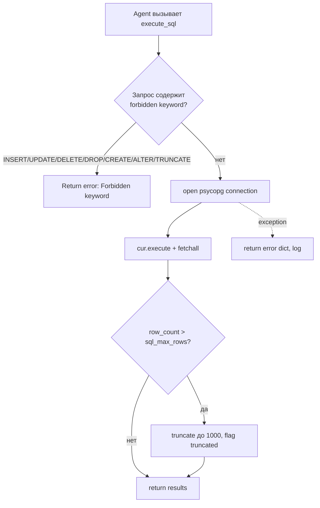

# Инструменты и интеграции (Требование 2/5)

**Цель документа:** описать реализованные инструменты (API / SQL / сервис), настройку вызова через function calling, SOP использования инструмента и обработку базовых ошибок.

---

## 1. Реестр инструментов (ToolRegistry)

Единый источник истины об инструментах — YAML-файлы в `skills/` (`rag_search.yaml`, `sql_query.yaml`, `code_validator.yaml`). Класс `ToolRegistry` (`src/skills.py:69`) при инициализации:

1. загружает все `skills/*.yaml` (`load_skill` с `lru_cache`);
2. строит OpenAI-совместимые определения tool из YAML-схемы (`build_tool_definition`, `src/skills.py:46`);
3. по имени вызова (`_execute` / `execute_to_json`) диспетчеризует через маппинг `_HANDLERS` в реальную реализацию из `src/tools/`.

Каждый скилл теперь описывает **полный контракт** инструмента. Помимо
`input_schema`/`output_schema` он несёт `objective`, `when_to_use`, `constraints`
(`enum` / `allowlist_prefix` / `single_statement` / `min` / `max`), `sop`
(пошаговая инструкция использования) и `guardrails` (запрещённые действия,
необходимость human approval). `build_tool_definition` (`src/skills.py`) строит
OpenAI-совместимое определение и:
- вшивает `objective` / `when_to_use` / `returns` / `sop` / `guardrails` прямо в
  поле `description` — модель получает рабочую инструкцию и сигнал выбора;
- **поднимает объявленные `constraints` в саму JSON-схему** аргументов
  (`enum` → `enum`, `min`/`max` → `minimum`/`maximum`, `allowlist_prefix` →
  `pattern`), чтобы модель была структурно ограничена ещё до рантайм-валидации.

Диспетчеризация выполняется через data-driven маппинг `_HANDLERS`
(skill-имя → callable из `src/tools`), а не ветвлением `if name ==`. Добавление
нового скилла = дописать запись в `_HANDLERS`; код реестра не дублируется. Сами
функции инструментов импортируются внутри обёрток в момент вызова, поэтому
монkeypatch в тестах работает корректно.

`ToolRegistry._validate` приводит аргументы к типам **и** проверяет объявленные
`constraints`, выбрасывая `ValueError` при нарушении (ошибка ловится и деградирует
на уровне агента/узла/графа).

Сопоставление типов YAML → JSON Schema: `_TYPE_MAP` (`src/skills.py:11`). Обязательность параметра выводится из отсутствия префикса `optional[`.

### 1.1 Три реализованных инструмента

| Инструмент | Тип интеграции | Файл | Назначение |
|---|---|---|---|
| `sql_query` | SQL (PostgreSQL) | `src/tools/sql_tool.py` | структурированные выборки требований/ТК |
| `rag_search` | Векторный сервис (pgvector) | `src/tools/rag_tool.py` | семантический поиск похожих ТК/требований |
| `code_validator` | Детерминированный сервис (без LLM/БД) | `src/tools/code_validator.py` | статическая проверка структуры ТК |

---

## 2. Function calling — настройка вызова

Механизм реализован в `RouterAIProvider.invoke_with_tools` (`src/llm_provider.py:153`):

1. LLM получает `system_prompt`, `user_message` и список `tools` (OpenAI-совместимые определения из `ToolRegistry.tools`).
2. Провайдер делает до `max_iterations` раундов:
   - POST `/chat/completions` с `tools` + `tool_choice`;
   - если в ответе есть `tool_calls` — для каждого вызова декодируются аргументы (`json.loads(fn["arguments"])`), выполняется `registry.execute_to_json(name, args)`;
   - результат кладётся в `messages` как `{"role": "tool", "content": result, "tool_call_id": ...}`;
   - если `tool_calls` пусты — цикл завершается.
3. `return_tool_results=True` возвращает сырые JSON-результаты инструментов (используется Coverage-агентом для извлечения похожих ТК), иначе — финальный текст ассистента.

Несколько раундов склеиваются в валидный JSON через `_coerce_tool_results` (`src/llm_provider.py:24`).

### 2.1 Пример определения tool (из `skills/sql_query.yaml`)

```yaml
name: sql_query
input_schema:
  query: string
output_schema:
  results: list
  row_count: int
  error: optional[string]
```

Преобразуется в:

```json
{
  "type": "function",
  "function": {
    "name": "sql_query",
    "description": "Skill для выполнения SQL-запросов к базе данных PostgreSQL...",
    "parameters": {
      "type": "object",
      "properties": { "query": { "type": "string" } },
      "required": ["query"]
    }
  }
}
```

---

> Поле `description` выше формируется `build_tool_definition` и теперь включает
> также `Returns` / `SOP` / `Guardrails` из соответствующего `skills/*.yaml`,
> чтобы модель видела контракт и ограничения использования инструмента.

## 3. SOP использования инструментов

### 3.1 SOP: `sql_query` (структурированное чтение из БД)



- **Правило доступа:** только `SELECT`. Блок запрещённых ключевых слов (`src/tools/sql_tool.py:36`) отсекает мутации до обращения к БД. Кроме того, уровень tool-реестра (`ToolRegistry._validate`) требует, чтобы запрос **начинался с `SELECT`/`WITH`/`EXPLAIN`** и состоял **из одного statement** (allowlist из `skills/sql_query.yaml`); `execute_sql` оставляет denylist как второй рубеж (defense-in-depth).
- **Проекция колонок:** явные списки `REQUIREMENT_COLS` / `TEST_CASE_COLS` исключают тяжёлый вектор-столбец `vector(1536)` из выборки (защита от многомегабайтного payload).
- **Лимит:** `sql_max_rows=1000` (`Settings`), признак `truncated` проставляется в результат.
- **Использование:** `get_all_requirements`, `get_test_cases_by_reqs`, `get_tests_without_requirements` и др. (`src/tools/sql_tool.py:69+`).

### 3.2 SOP: `rag_search` (векторный retrieval)

```mermaid
flowchart TD
    A[Agent вызывает rag_search collection,query,top_k] --> B[EmbeddingProvider.embed_text]
    B -->|fail| Z[log + return []]
    B --> C{collection in<br/>requirements, test_cases?}
    C -->|нет| Y[log warning + return []]
    C -->|да| D[SQL: ORDER BY embedding <=> query LIMIT top_k]
    D -->|OK| E[map rows -> {id,title,content,similarity}]
    D -.exception.-> F[log + return []]
```

- Косинусное сходство: `1 - (embedding <=> %s::vector)` (оператор `<=>` pgvector, `src/tools/rag_tool.py:45`).
- Индексы `ivfflat (vector_cosine_ops)` на `embedding` (`migrations/001_initial.sql:40-41`).
- Тихий фоллбэк: при любом сбое (эмбеддинг/БД) возвращается `[]` — агент продолжает работу без RAG-контекста.

### 3.3 SOP: `code_validator` (детерминированная статическая проверка)

- Без LLM и БД. Проверяет: пустые/placeholder поля (`preconditions`, `test_data`, `expected_result`, `steps`), несбалансированные скобки, отсутствие/неверная привязка `req`, дубликаты по `(req, title)`.
- Используется Design-агентом как **достоверный факт** вместо LLM-гипотез о «валидности» тестов (`src/agents/design_agent.py:131`).

### 3.4 SOP: агентный retrieval (управление со стороны агента)

Coverage-агент сам принимает решение о вызове RAG: если `settings.rag_enabled` и есть требования, он через `invoke_with_tools` принудительно вызывает `rag_search` (`tool_choice={"type":"function","function":{"name":"rag_search"}}`) для нахождения *косвенно* покрывающих ТК. При сбое `invoke_with_tools` — фоллбэк к прямому `registry.execute("rag_search", ...)` (`src/agents/coverage_agent.py:186-216`).

---

## 4. Обработка базовых ошибок вызова

| Точка | Ошибка | Обработка |
|---|---|---|
| `sql_query` | forbidden keyword | возврат `{"error": "Forbidden keyword: ..."}`, БД не трогается |
| `sql_query` | любое исключение БД | `return {"results":[], "row_count":0, "error": str(e)}`, `logger.error` |
| `rag_search` | эмбеддинг недоступен | `return []` |
| `rag_search` | неизвестная коллекция | `return []` |
| `rag_search` | исключение БД | `return []` |
| `code_validator` | — | не падает, возвращает `findings` |
| `invoke_with_tools` | невалидный JSON аргументов | `args = {}` |
| `ToolRegistry._validate` | нарушение `constraints` (enum / allowlist_prefix / несколько statement) | `raise ValueError` → ловится узлом/агентом, повтор через `quality_gate` |
| LLM пустой ответ | `ValueError` | повтор через tenacity + фоллбэк json_schema→json_mode |
| Агент (coverage/design) | LLM вернул не объект | `raise` → узел графа ловит → `quality_gate` retry |

Важно: ошибки инструментов **не крашат граф** — они возвращают безопасные значения, а сбои самих агентов перехватываются узлами (`run_coverage_node` и т.п., `src/graph.py:164`) и агрегируются в `state.errors`, после чего `quality_gate` инициирует targeted retry.

---

## 5. Резюме по требованию 2/5

| Пункт | Статус | Реализация |
|---|---|---|
| ≥1 инструмент (API/SQL/сервис) | ✅ | 3 инструмента: SQL, pgvector RAG, code_validator |
| Function calling настроен | ✅ | `invoke_with_tools` + `ToolRegistry`, OpenAI-совместимые схемы из YAML |
| SOP использования инструмента | ✅ | раздел 3 (sql/rag/validator/agent-retrieval) |
| Обработка базовых ошибок | ✅ | safe-return, forbidden keywords, retry, quality_gate retry |
