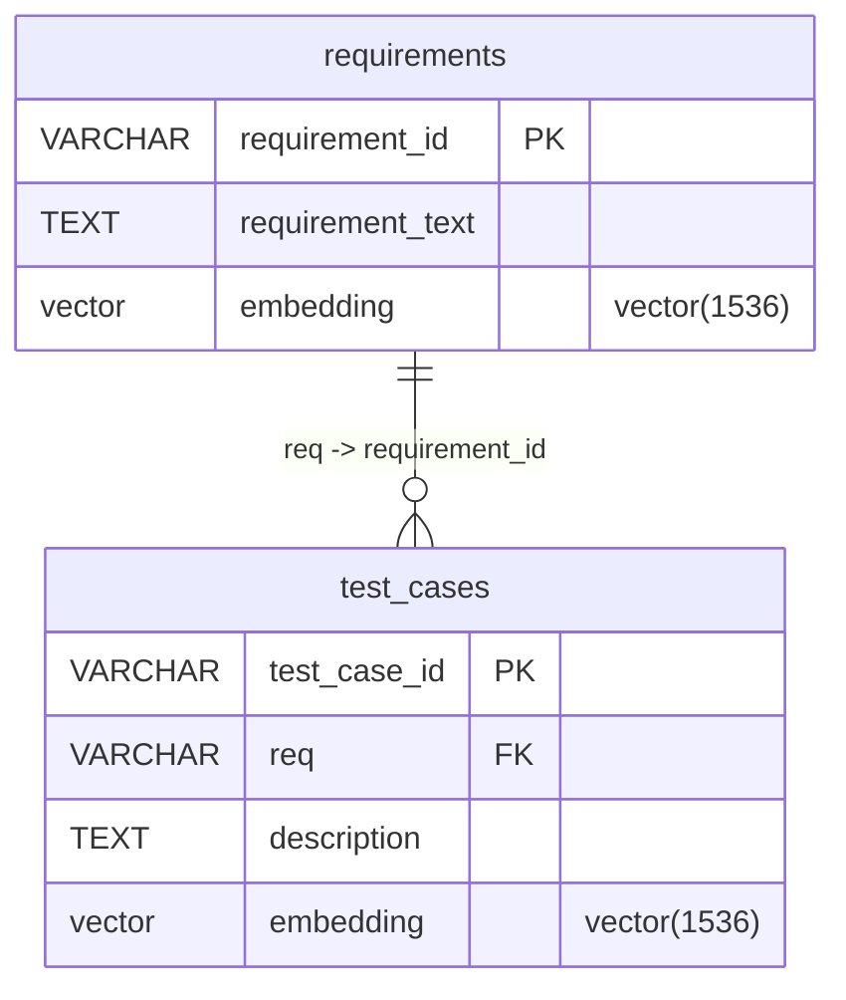
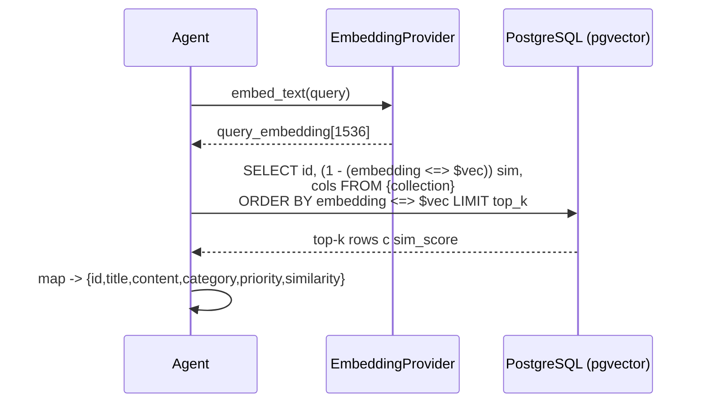
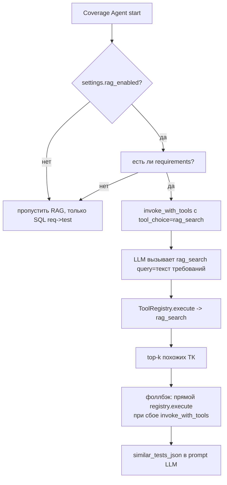

# Память и контекст (Требование 3/5)

**Цель документа:** описать подключение векторной памяти, реализацию поиска релевантной информации (RAG), управление retrieval со стороны агента и (опционально) гибридный поиск.

---

## 1. Векторная память

Векторная память реализована **нативно в PostgreSQL** через расширение `pgvector` — отдельный векторный стор (Weaviate/Pinecone/Qdrant) не используется, что упрощает инфраструктуру до одной БД.

### 1.1 Схема хранения (`migrations/001_initial.sql`)

- Поле `embedding vector(1536)` в обеих таблицах (`001_initial.sql:17`, `:36`).
- Индексы косинусного поиска: `ivfflat (embedding vector_cosine_ops) WITH (lists = 100)` (`001_initial.sql:40-41`).

### 1.2 Генерация эмбеддингов (`src/embedding.py`)

- `EmbeddingProvider.embed_text` → вызов `/embeddings` провайдера `RouterAI` с моделью `model_embedding` (`openai/text-embedding-3-small`, 1536-dim).
- **Ручной кэш** `_embed_cache[(text, model)]` (`src/embedding.py:16`) — намеренно dict (а не `lru_cache` на сетевой функции), чтобы не кэшировать исключения и не ломать повторные попытки.
- Повторы при сбое: декоратор `@retry(stop_after_attempt(3), wait_exponential)` на `_embed_uncached` (`src/embedding.py:19`).
- Каждый вызов обёрнут в спан `trace_embedding` с маскировкой чувствительных данных.

---

## 2. Поиск релевантной информации (RAG)

Ядро retrieval — `rag_search` (`src/tools/rag_tool.py:16`):

- Сходство: `sim_score = 1 - (embedding <=> query_embedding)` (косинусная дистанция pgvector).
- `top_k` по умолчанию `rag_top_k=10` (`Settings`).
- Возвращаемые поля адаптируются под коллекцию (для `requirements` — `requirement_text`/`category`; для `test_cases` — `description`/`test_type`).
- Спан `trace_retriever` + `set_retrieval_documents` записывают найденные документы в Phoenix (OpenInference semconv).
- **Безопасность retrieval:** при сбое эмбеддинга/БД/неизвестной коллекции — возврат `[]`, агент продолжает без RAG-контекста.

### 2.1 Точки вызова RAG
- **Coverage Agent** — семантический поиск ТК, косвенно покрывающих требования (см. раздел 3), единственный вызывающий сторона `rag_search` в коде.
- Точный структурный SQL-маппинг `req → test_cases` реализован отдельными функциями `get_test_cases_by_reqs` / `get_requirements_by_ids` (`src/tools/sql_tool.py:79`), которые **не** являются RAG — это детерминированный путь, дополняемый семантическим `rag_search` (см. раздел 4, гибридный поиск).

---

## 3. Управление retrieval со стороны агента

Retrieval не является «скрытым» автоматическим шагом — им **управляет сам агент** через function calling.

Логика в Coverage Agent (`src/agents/coverage_agent.py:172-229`):

Агент:
1. принимает решение о необходимости RAG на основе `settings.rag_enabled` и наличия требований;
2. формулирует запрос (`combined_req_text` = заголовки + тексты требований);
3. через `tool_choice` **принудительно** вызывает `rag_search` (а не оставляет на усмотрение LLM);
4. при сбое `invoke_with_tools` — откат к прямому `registry.execute`;
5. встраивает результат в промпт как «косвенно покрывающие тест-кейсы».

Таким образом агент контролирует *что*, *где* (`collection`) и *зачем* искать, а не полагается на неявный retrieval.

---

## 4. Гибридный поиск (опционально)

Система реализует **простой гибридный поиск** в Coverage Agent: точный структурный SQL-маппинг `req → test_cases` **дополняется** семантическим RAG-поиском похожих ТК.

| Источник | Тип | Что даёт |
|---|---|---|
| `get_test_cases_by_reqs` (SQL, точное совпадение `req`) | Структурный | явное, детерминированное покрытие |
| `rag_search(collection=test_cases)` (векторный) | Семантический | ТК, косвенно покрывающие требование без явной привязки `REQ` |

Результаты обоих источников попадают в промпт LLM (`src/agents/coverage_agent.py:231-246`): блок «Тесты без требований» (SQL) + блок «Семантически похожие тест-кейсы» (RAG). Агрегация итоговых метрик покрытия производится **детерминированно в коде** (`_recompute_coverage`, `src/agents/coverage_agent.py:36`), а не арифметикой LLM.

---

## 5. Резюме по требованию 3/5

| Пункт | Статус | Реализация |
|---|---|---|
| Векторная память подключена | ✅ | pgvector, `embedding vector(1536)`, ivfflat-индексы |
| Поиск релевантной информации (RAG) | ✅ | `rag_search` (косинусное сходство) |
| Управление retrieval со стороны агента | ✅ | Coverage Agent через `invoke_with_tools` + `tool_choice` |
| Гибридный поиск (опц.) | ✅ | SQL `req→test` + семантический RAG |
