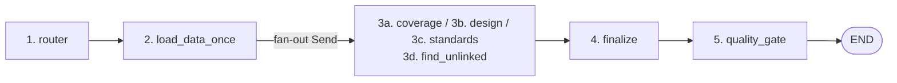
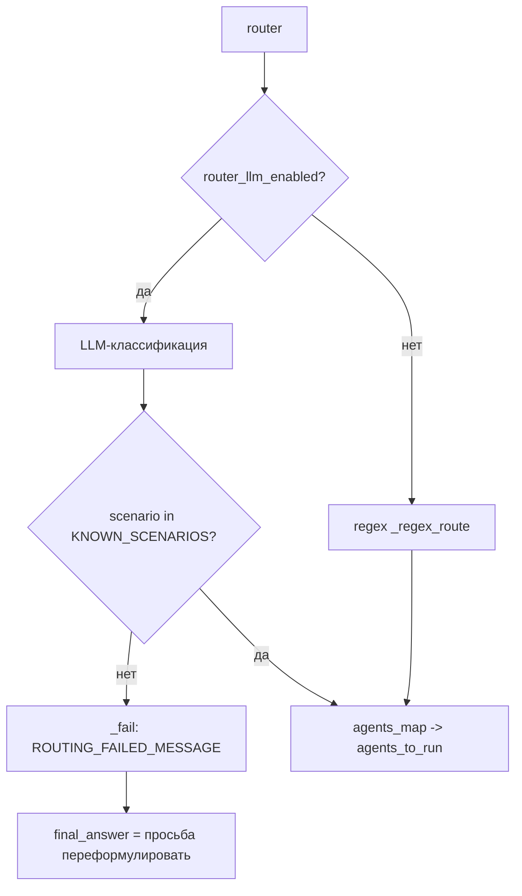
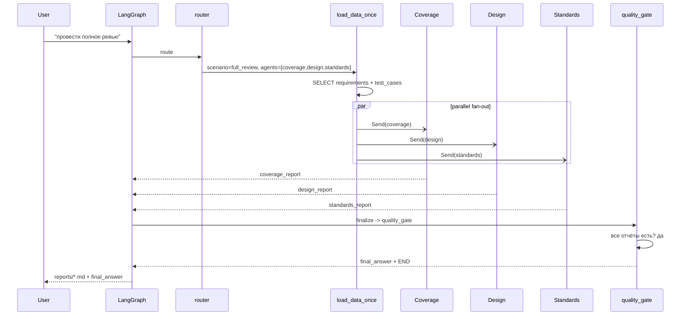

# Оркестрация и выполнение (Требование 4/5)

**Цель документа:** описать последовательность выполнения из 3–5 шагов, ветвления/проверки, использование SDK (LangGraph) и (опционально) взаимодействие между агентами.

---

## 1. Используемый SDK — LangGraph

Оркестрация построена на **LangGraph** (`langgraph.graph.StateGraph`, `src/graph.py:347`). Состояние — Pydantic-модель `ReviewState` (`src/models.py:76`), передающаяся между узлами. Checkpointer по умолчанию — `MemorySaver` (`src/report.py:297`), с возможностью `PostgresSaver` для resume между перезапусками.

---

## 2. Последовательность выполнения (шаги графа)

Граф собирается в `build_graph` (`src/graph.py:347`):



**Шаг 1 — `router` (`src/graph.py:79`).** Классификация запроса → `scenario`, `requirement_ids`, `agents_to_run`. Источник истины — LLM-классификатор (`model_junior`) либо regex-фоллбэк (`_regex_route`).

**Шаг 2 — `load_data_once` (`src/graph.py:224`).** Селективная однократная выгрузка в `state`:
- `find_unlinked_tests` → пропуск (свой целевой SQL в узле);
- `requirement_coverage` + REQ-id → только запрошенные требования и их ТК;
- остальные → полная выгрузка.

**Шаг 3 — параллельный fan-out агентов (`_fan_out`, `src/graph.py:146`).** Через LangGraph `Send` независимые агенты запускаются **одновременно**, а не цепочкой. Каждый пишет только свой report-ключ (`coverage_report` / `design_report` / `standards_report`), поэтому параллельные записи не пересекаются — гонки исключены. Для `find_unlinked_tests` маршрут идёт на отдельный узел `find_unlinked`.

**Шаг 4 — `finalize` (`src/graph.py:280`).** Точка конвергенции веток перед проверкой качества.

**Шаг 5 — `quality_gate` (`src/graph.py:313`).** Проверка комплектности отчётов и при частичном сбое — targeted retry.

---

## 3. Ветвления и проверки

### 3.1 Маршрутизация (branch по scenario)



- Проверка `scenario not in KNOWN_SCENARIOS` (`src/graph.py:113`) → безопасный выход с просьбой переформулировать.
- `agents_map` (`src/graph.py:122`) преобразует scenario в набор узлов.

### 3.2 Fan-out (conditional edges)

`workflow.add_conditional_edges("load_data_once", _fan_out)` (`src/graph.py:365`) — динамический выбор узлов на основе `state.agents_to_run` и `state.scenario`.

### 3.3 Quality gate (retry branch)

```mermaid
flowchart TD
    Q[quality_gate] --> C{есть missing отчёты?}
    C -->|нет| FIN[aggregate final_answer]
    C -->|да| R{targeted_retry_enabled<br/>AND iteration <= max_retry_attempts?}
    R -->|да| S[Command goto=Send(missing agents)]
    S --> AG[повтор ONLY упавших]
    AG --> Q
    R -->|нет| FIN
```

- `missing` = ожидаемые агенты, у которых report `None` (`src/graph.py:326-327`).
- Retry через `Command(goto=[Send(a, state) ...])` — повторяются **только упавшие** агенты, а не весь прогон.
- Счётчик `state.iteration` + `max_retry_attempts=2` защищает от бесконечного цикла.

---

## 4. Взаимодействие между агентами (опционально)

Агенты **независимы** (fan-out), но координируются через общее состояние `ReviewState` и единый контракт входных данных:

- **Общее прочтение из БД** на шаге `load_data_once` — все агенты видят один и тот же срез `requirements`/`test_cases` (детерминированность, отсутствие рассинхрона).
- **Общий реестр правил** `data/standards_rules.yaml` — единый источник для Standards Agent (и implicit контракт для其余).
- **Сходимость в `finalize` + `quality_gate`** — оркестратор «знает» о всех агентах и собирает результат.
- Косвенное взаимодействие: Coverage Agent питает RAG-контекстом свой промпт, а Design Agent использует `code_validator` как внешний детерминированный «суб-агент» (tool), чьи находки передаются LLM как достоверные факты.

---

## 5. Цепочка выполнения full_review (сквозной пример)



---

## 6. Резюме по требованию 4/5

| Пункт | Статус | Реализация |
|---|---|---|
| Последовательность 3–5 шагов | ✅ | router → load_data_once → fan-out агентов → finalize → quality_gate |
| ≥1 ветвление/проверка | ✅ | routing branch, conditional fan-out, quality_gate retry |
| SDK/langgraph/n8n | ✅ | LangGraph `StateGraph` + `Send`/`Command` |
| Взаимодействие между агентами (опц.) | ✅ | fan-out + общее state + code_validator как sub-tool |
