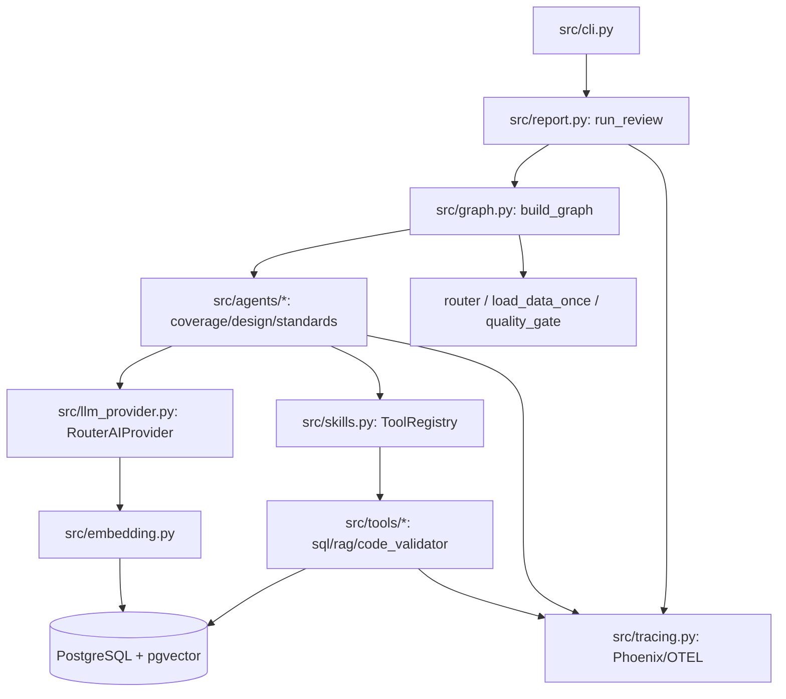

# QA Review Agent — Техническая документация

Мультиагентная система автоматического ревью тестовой документации (требования + тест-кейсы интернет-магазина), построенная на **LangGraph**, **PostgreSQL + pgvector**, провайдере LLM **RouterAI** и трассировке **Phoenix/OTEL**.

## Состав документации по требованиям

| # | Документ | Тема |
|---|---|---|
| 1/5 | [01_architecture.md](01_architecture.md) | Архитектура и сценарий: кейс, Reason→Act→Observe, выбор моделей, схема |
| 2/5 | [02_tools.md](02_tools.md) | Инструменты и интеграции: `sql_query`, `rag_search`, `code_validator`, function calling, SOP, ошибки |
| 3/5 | [03_memory.md](03_memory.md) | Память и контекст: pgvector, RAG, agent-controlled retrieval, гибридный поиск |
| 4/5 | [04_orchestration.md](04_orchestration.md) | Оркестрация: LangGraph StateGraph, 5 шагов, ветвления, retry |
| 5/5 | [05_evaluation.md](05_evaluation.md) | Оценка и безопасность: метрики, трассировка, retry/лимиты, валидация вывода |

## Краткая карта модулей



## Стек
- **Оркестрация:** LangGraph (`StateGraph`, `Send`, `Command`, `MemorySaver`).
- **LLM/Embedding:** RouterAI (`chat/completions`, `/embeddings`), модели junior/senior/embedding.
- **Хранилище:** PostgreSQL + pgvector (таблицы `requirements`, `test_cases`).
- **Трассировка:** OpenTelemetry + Phoenix (OpenInference semconv).
- **Конфигурация:** `pydantic-settings` (`src/config.py`), `.env`.

## Быстрый старт (для разработчика)
```bash
cd qa-review-agent
.venv\Scripts\activate
qa-review "провести полное ревью"
qa-review "проверить покрытие REQ-001"
qa-review "найти тесты без требований"
python -m eval.run_eval          # регрессионная оценка golden-датасетом
pytest tests/unit tests/integration
```
